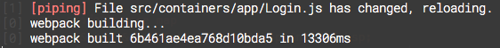
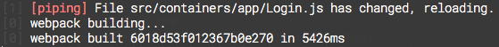
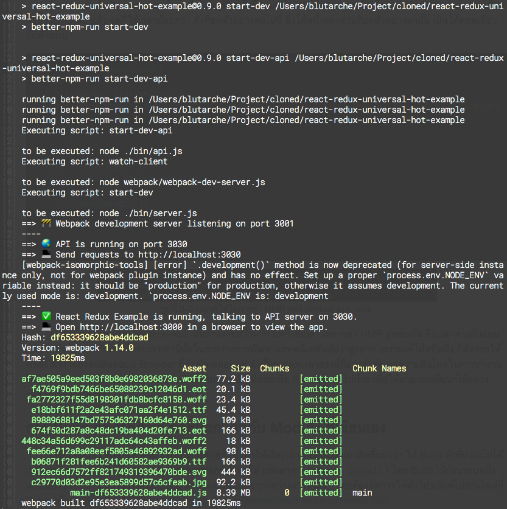
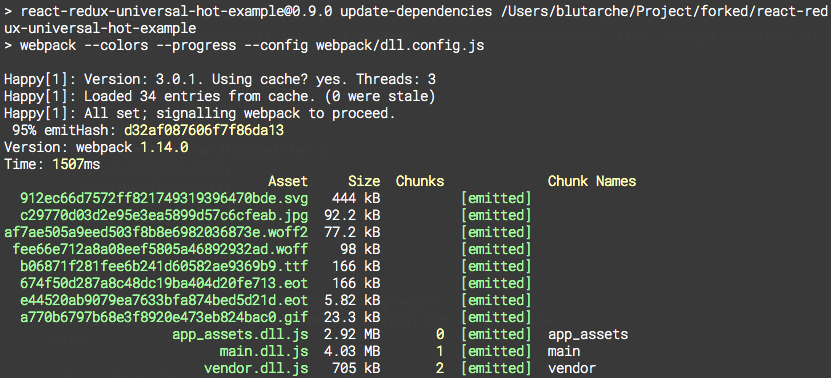
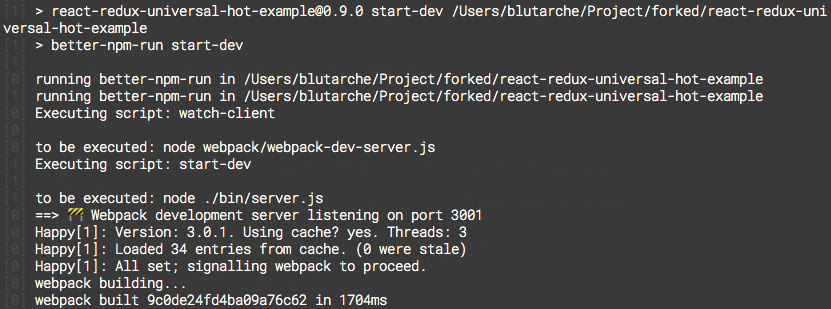

<h1 align="center">ทฤษฎีที่เกี่ยวข้อง</h1>

## การรักษาคุณภาพโค้ดด้วย Linter
&nbsp;&nbsp;&nbsp;&nbsp;&nbsp;&nbsp;&nbsp;&nbsp;
เนื่องจากการทำงานย่อมต้องมีมาตรฐาน หรือกฎที่กำหนดใช้ร่วมกัน รวมไปถึงการเขียนโปรแกรมอย่างมีมาตรฐานด้วย ซึ่งแต่ละทีมก็จะมีการตกลงมาตรฐานดังกล่าวที่แตกต่างกันไป แต่การที่โปรแกรมเมอร์จะสามารถคำนึงถึงมาตรฐานดังกล่าวตลอดเวลาที่เขียนโปรแกรมนั้นเป็นเรื่องที่ยาก รวมไปถึงถ้าหากเขียนโค้ดไปจำนวนมากแล้ว การจะกลับมาแก้โค้ดทั้งหมดให้ผ่านมาตรฐานของทีมก็เป็นงานที่เหนื่อยและลำบากพอสมควร จึงมีเครื่องมือที่ชื่อว่า `Linter` ขึ้นมา

&nbsp;&nbsp;&nbsp;&nbsp;&nbsp;&nbsp;&nbsp;&nbsp;
ซึ่ง `Linter` จะทำการกำหนดมาตรฐานของโค้ดไว้ และสามารถเรียกใช้เพื่อตรวจโค้ดทั้งหมดในโปรเจ็กต์ได้ ว่ามีส่วนไหนที่ผิดจากรูปแบบที่กำหนดหรือไม่ ตัวอย่างเช่น
```javascript
const f = function(res) {
  // do something
};
```
&nbsp;&nbsp;&nbsp;&nbsp;&nbsp;&nbsp;&nbsp;&nbsp;
แต่ทางทีมต้องการใช้ arrow function ในทุกๆที่ ตัว Linter ก็จะบังคับให้เขียนในรูปแบบด้านล่างนี้ มิเช่นนั้นจะแจ้ง Error
```javascript
const f = (res) => {
  // do something
};
```

&nbsp;&nbsp;&nbsp;&nbsp;&nbsp;&nbsp;&nbsp;&nbsp;
ซึ่งนอกจากการที่ต้องมาเรียกใช้ผ่าน Command line เองแล้ว Editor บางตัวก็ยังมี Plugin สำหรับตรวจ Lint ในระหว่างที่กำลังโค้ดอยู่ด้วย เช่น [Atom](https://atom.io/) ก็มี Plugin [linter-eslint](https://atom.io/packages/linter-eslint) ให้ใช้งาน ทำให้การโค้ดสะดวกสบายมากยิ่งขึ้น

## Optimizing Webpack
* http://www.slideshare.net/trueter/how-to-make-your-webpack-builds-10x-faster
* http://stackoverflow.com/questions/38939274/babel-loader-cachedirectory-unknown-option
* https://github.com/amireh/happypack

&nbsp;&nbsp;&nbsp;&nbsp;&nbsp;&nbsp;&nbsp;&nbsp;
เทคนิคการทำให้ Webpack เร็วขึ้นที่ได้ทดลองใช้คือ
1. ใช้ Happypack
2. การเปลี่ยนประเภทของ Source map
3. การ Build ตัว modules ข้างนอกต่างๆก่อน

### การทำงานของ Happypack
&nbsp;&nbsp;&nbsp;&nbsp;&nbsp;&nbsp;&nbsp;&nbsp;
[Happypack](https://github.com/amireh/happypack) ช่วยเหลือในการทำ Cache ไฟล์ที่ไม่เปลี่ยนแปลง โดยจะนำไฟล์เหล่านั้นมาใช้ในการ Build ครั้งต่อไปโดยไม่จำเป็นต้องโหลดไฟล์ใหม่ ทำให้การ Build ถัดจากครั้งแรกเร็วขึ้นอย่างเห็นได้ชัด

> ดังที่เห็นในหัวข้อลักษณะงานที่ปฏิบัติ ข้อ 2.6 ที่เวลาในการ Build ลดลงนับสิบเท่าในการ Build ครั้งถัดมา หรือรูปที่ 3-3 และ 3-4

&nbsp;&nbsp;&nbsp;&nbsp;&nbsp;&nbsp;&nbsp;&nbsp;
รวมทั้ง Happypack เองก็จะ Build แบบ Parallel โดยเปิด Thread เพิ่มเติมมาช่วยในการ Build ทำให้เร็วยิ่งขึ้นไปอีก

### การทำ Source map
&nbsp;&nbsp;&nbsp;&nbsp;&nbsp;&nbsp;&nbsp;&nbsp;
ในการตั้งค่า Webpack ให้กับโปรเจ็กต์นั้น มีค่าหนึ่งคือค่า `devtool` ที่จะระบุวิธีการทำ Source map ของการ Build [โดยที่มีหลายระดับ และแต่ละระดับก็จะมีความเร็วในการ Build ที่แตกต่างกันไป](https://webpack.github.io/docs/build-performance.html) ซึ่งยิ่งความเร็วในการ Build มาก Readability ก็ยิ่งน้อยลงตาม ซึ่งเป็นเรื่องการ Trade-off ที่ต้องชั่งน้ำหนักดู

&nbsp;&nbsp;&nbsp;&nbsp;&nbsp;&nbsp;&nbsp;&nbsp;
โดยแบบที่อ่านออกมากที่สุดคือ `source-map` ซึ่งขอยกตัวอย่างโค้ดส่วนหนึ่ง รวมทั้งเวลาที่ใช้ในการทำ Hot Module Replacement หากมีการแก้โค้ดมาดังนี้

```javascript
// Component
<div className="text-center">
  
</div>

// Function
handleSubmit(e) {
  e.preventDefault();
  this.handleLogin();
}
```

<p align="center">
  <br>
  <small>รูปที่ 3-1 เวลาที่ใช้ในการทำ HMR ของ devtool แบบ source-map</small>
</p>

&nbsp;&nbsp;&nbsp;&nbsp;&nbsp;&nbsp;&nbsp;&nbsp;
ซึ่งโค้ดข้างต้นที่เห็นนั้น คือโค้ดที่ตรงกับโค้ดที่โปรแกรมเมอร์เขียน ซึ่งก็คือตัว Build จะทำการ Map โค้ดหลังจาก Compiled กลับให้ว่าโค้ดต้นแบบหน้าตาเป็นอย่างไร แต่ก็ใช้เวลาไปไม่น้อย คือ 13306 milliseconds

&nbsp;&nbsp;&nbsp;&nbsp;&nbsp;&nbsp;&nbsp;&nbsp;
ในทางกลับกัน Source map ที่ทางทีมใช้อยู่ปัจจุบันคือแบบ `eval` ซึ่งจะ map กับเพียงแค่ Module เท่านั้น และเป็นตัวที่ Compiled แล้ว แต่ก็ใช้เวลาน้อยกว่า ดังที่ยกตัวอย่างต่อไปนี้ ซึ่งโค้ดทั้งสองส่วนที่ยกตัวอย่างมานั้น เป็นโค้ดชุดเดียวกับด้านบน

```javascript
// Component
_base.React.createElement(
  'div',
  { className: 'text-center' },
  _base.React.createElement('img', { className: _Login2.default.header, src: '/images/logo.png' })
)

// Function
{
  key: 'handleSubmit',
  value: function handleSubmit(e) {
    e.preventDefault();
    this.handleLogin();
  }
}
```

<p align="center">
  <br>
  <small>รูปที่ 3-2 เวลาที่ใช้ในการทำ HMR ของ devtool แบบ eval</small>
</p>

&nbsp;&nbsp;&nbsp;&nbsp;&nbsp;&nbsp;&nbsp;&nbsp;
จะเห็นได้ว่าโค้ดแบบ `source-map` นั้นอ่านง่ายกว่ามาก แต่ก็ใช้เวลาในการทำ HMR สูงเช่นกัน ซึ่งเวลาต่างกับแบบ `eval` ประมาณ 8 วินาที โดยเวลาเท่านี้นั้นในระหว่างการพัฒนาแอพพลิเคชั่นนับว่าสูงมาก เพราะแก้โค้ดทีหนึ่ง ก็ต้องรอให้ HMR ทำงานถึงจะเห็นผลบน Browser ที่กำลังทดสอบอยู่ ดังนั้นการลดเวลาตรงนี้ถือว่าสำคัญต่อความลื่นไหลในการทำงาน ไม่ให้สะดุดรอ จึงมีหลายกรณี(รวมถึงกรณีของทีมข้าพเจ้า) ที่ยอมเสีย Readability ไปบ้าง เพื่อให้สามารถพัฒนาได้อย่างรวดเร็วและลื่นไหลขึ้น

### การ Build ตัว Module ภายนอกแยกกับ Module ที่เขียนเอง
&nbsp;&nbsp;&nbsp;&nbsp;&nbsp;&nbsp;&nbsp;&nbsp;
โดยปกติแล้ว Webpack จะ Build ใหม่ทุกครั้ง ซึ่งทำให้เสียเวลา ดังนั้นจึงมีแนวคิดขึ้นมาว่า ให้ Build ตัวที่น่าจะไม่ได้เปลี่ยนบ่อยๆก่อน หรือก็คือ Module ของภายนอกที่นำมาใช้ (เช่นมาจากการ `npm install`) โดย Build ไว้ก่อนรอบหนึ่ง แล้วเมื่อต้องการทำงานจริง ก็ค่อย Build ตัวที่จะเปลี่ยนบ่อยๆระหว่างการพัฒนา โดยต้องจัดการให้ตัวโปรเจ็กต์ไปอ่านไฟล์ที่ Build เสร็จก่อนหน้านี้มาใช้ (ที่มา: https://github.com/erikras/react-redux-universal-hot-example/issues/616#issuecomment-228956242)

<p align="center">
  <br>
  <small>รูปที่ 3-3 เวลาที่ใช้ในการ Build แบบก่อนปรับแต่ง</small>
</p>

&nbsp;&nbsp;&nbsp;&nbsp;&nbsp;&nbsp;&nbsp;&nbsp;
ซึ่งก่อนปรับแต่งนั้น การ Build ทุกครั้งก็ต้องใช้เวลานานระดับหนึ่ง (ในที่นี้คือ 19825 milliseconds)

<p align="center">
  <br>
  <small>รูปที่ 3-4 เวลาที่ใช้ในการ Build Module ภายนอกหลังปรับแต่ง</small>
</p>

<p align="center">
  <br>
  <small>รูปที่ 3-5 เวลาที่ใช้ในการ Build Module ภายในหลังปรับแต่ง</small>
</p>

&nbsp;&nbsp;&nbsp;&nbsp;&nbsp;&nbsp;&nbsp;&nbsp;
ซึ่งหลังปรับแต่งนั้น ทุกครั้งที่มีการเปลี่ยน Module ภายนอกจะใช้เวลาในการ Build ใหม่ 1507 milliseconds (ทั้งนี้นี่คือการผ่าน cache แล้ว ถ้าหากไม่มี cache ก็จะใช้เวลาใกล้เคียงกับก่อนปรับแต่ง) แต่หลังจากนั้นจะใช้เวลาน้อยมากในการ Build Module ภายใน

&nbsp;&nbsp;&nbsp;&nbsp;&nbsp;&nbsp;&nbsp;&nbsp;
โดยธรรมชาติของการพัฒนาแอพพลิเคชั่นนั้น การเปลี่ยน Module ภายนอกที่ใช้ไม่ได้เกิดขึ้นบ่อยนัก ดังนั้นการ Optimize แบบนี้จึงส่งผลมาก และช่วยให้การพัฒนาแอพพลิเคชั่นเป็นไปได้อย่างราบรื่นมากขึ้น
