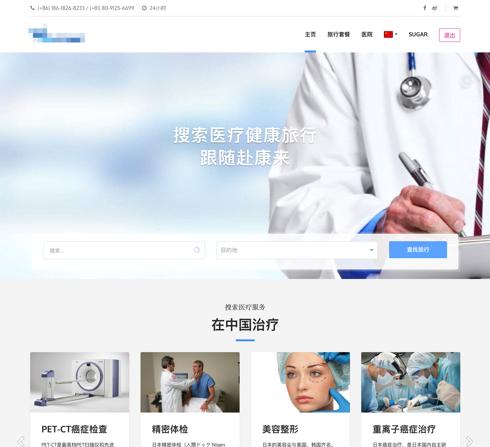
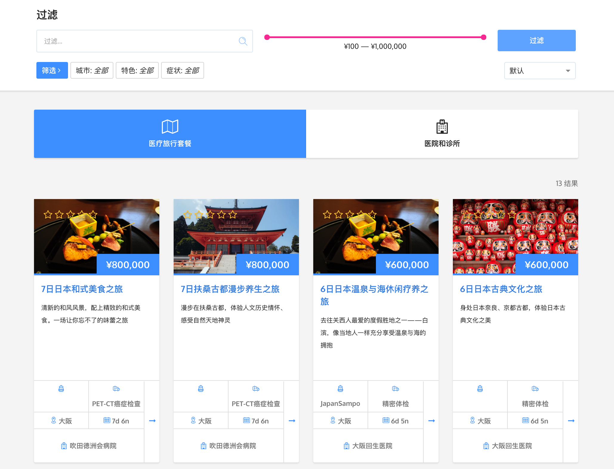

<h1 align="center">ลักษณะของงานที่ปฏิบัติ</h1>

## 1. บันทึกประจำวันการปฏิบัติงาน

> *TODO: เพิ่มตาราง*

## 2. รายละเอียดของงานที่ปฏิบัติ

***เนื่องจากงานหลายชิ้นอยู่ภายใต้ Non-disclosure agreement จึงไม่สามารถเปิดเผยชื่อผลงานได้***

> ชิ้นงานข้อ 2.1 กับ 2.2 ทำเสร็จสิ้นในช่วงฝึกงานปิดเทอม

#### 2.1 พัฒนาระบบ Admin ส่วน Frontend ด้วย AngularJS

  
  <small>รูปที่ 2-1 Screenshot หน้าจัดการ Image Size Presets ของระบบ Admin</small>

&nbsp;&nbsp;&nbsp;&nbsp;&nbsp;&nbsp;&nbsp;&nbsp;
เป็นการทดลองใช้ AngularJS ครั้งแรก ซึ่งทางพี่ผู้ดูแลงานนี้ได้ให้ Requirements จากทางผู้ว่าจ้างมา แล้วให้ลองศึกษาทำดูเลย ซึ่ง Admin ต้องกระทำการต่างๆได้ดังนี้

* จัดการ User accounts ทั้งหมด
* เขียนบทความ
* ลงรูปภาพ Banner
* ลงข้อมูลทั่วไป (ข้อมูลผลิตภัณฑ์ Disclaimer ข้อมูลติดต่อ ฯลฯ)
* จัดการ/เพิ่มสินค้า (ราคาในหน่วยเงินต่างๆ จำนวนสินค้าที่เหลือ ฯลฯ)
* จัดหมวดหมู่สินค้า
* จัดการโปรโมชั่น
* ตรวจสอบรายการสั่งซื้อ และยืนยันการชำระเงิน
* แก้ไขราคาค่าขนส่ง
* จัดการข้อมูลของตัวแทนจำหน่วย
* แก้ไขข้อมูลทางการเงิน (หน่วยเงิน ข้อมูลบัญชีที่รับการโอนเงิน ฯลฯ)
* ข้อมูลสีของตัวต่อที่ลูกค้าสามารถ Custom ได้
* ข้อมูลขนาดรูปภาพที่ลูกค้าสามารถนำมา Pixelate
* Preset ของการ Pixelate
* ข้อมูลบางส่วนสามารถ Export ออกมาในรูปแบบไฟล์​ Excel (.xlsx) ได้

&nbsp;&nbsp;&nbsp;&nbsp;&nbsp;&nbsp;&nbsp;&nbsp;
โดยใช้โครงสร้างของ AdminLTE เป็นหลัก ซึ่งปัญหาที่เจอโดยมากเกิดจาก Learning curve ที่ใช้เวลาในการศึกษาการใช้ Framework ที่ไม่เคยใช้มาก่อน แต่ก็ถือได้ว่าเป็นงานที่ไม่ซับซ้อนเกินไปนัก เหมาะเป็นงานชิ้นแรกสำหรับการเรียนรู้วิธีการทำงานขององค์กร

#### 2.2 พัฒนาระบบ Pixelate รูปภาพด้วย AngularJS
&nbsp;&nbsp;&nbsp;&nbsp;&nbsp;&nbsp;&nbsp;&nbsp;
เป็นงานที่ทำให้กับผู้ว่าจ้างรายเดียวกับงานในข้อ 2.1 ซึ่งเป็นระบบที่ให้ลูกค้าสามารถนำรูปภาพที่ต้องการมาทำการ Pixelate เพื่อนำไปสั่งซื้อสินค้าตัวต่อเพื่อนำมาต่อเป็นรูปภาพผลลัพธ์ได้

  
  <small>รูปที่ 2-2 ภาพก่อนและหลังการ Pixelate</small>

&nbsp;&nbsp;&nbsp;&nbsp;&nbsp;&nbsp;&nbsp;&nbsp;
โดยหลังจากลูกค้าปรับแต่งรูปเสร็จสิ้นแล้ว ระบบจะคำนวณสิ้นค้าที่ต้องใช้ทั้งหมดให้ เช่น ตัวต่อเม็ดสีต่างๆ เพลทที่เป็นฐานของรูป และตัวเชื่อมเพลทหากรูปภาพมีขนาดใหญ่ รวมถึงสามารถ Download ไฟล์ PDF ที่ถูก Generate ขึ้นมา ซึ่งจะมีคำแนะนำในการต่ออย่างละเอียด

  
  <small>รูปที่ 2-3 Screenshot หน้า Output ของระบบ Pixelate</small>

  
  <small>รูปที่ 2-4 ตัวอย่างบางส่วนของ PDF คำแนะนำการต่อรูป Pixelate</small>

#### 2.3 พัฒนาเว็บแอพพลิเคชันสำหรับแนะนำการรักษาพยาบาลและการท่องเที่ยวในต่างประเทศ ด้วย ReactJS, Redux

  
  <small>รูปที่ 2-5 Screenshot หน้าหลัก ของเว็บไซต์แนะนำการรักษาพยาบาลและการท่องเที่ยว</small>

&nbsp;&nbsp;&nbsp;&nbsp;&nbsp;&nbsp;&nbsp;&nbsp;
เป็นเว็บไซต์ที่จะแนะนำสถานพยาบาลที่มีคุณภาพในต่างประเทศ รวมถึงจัดแผนการท่องเที่ยวในประเทศนั้นๆให้ด้วย ซึ่งกลุ่มเป้าหมายหลักคือประชากรชาวจีน เนื่องจากโรงพยาบาลในจีนที่มีคุณภาพนั้นมีราคาที่สูง และมีผู้ใช้งานจำนวนมาก ทำให้การไปใช้บริการโรงพยาบาลในต่างประเทศ (เช่น​ ญี่ปุ่น ไทย) นั้นมีค่าใช้จ่ายที่ไม่ต่างกันมากนัก และผู้ใช้บริการหรือผู้ที่ติดตามไปก็สามารถท่องเที่ยวได้ด้วย

> ซึ่งเป็นครั้งแรกสำหรับการใช้ ReactJS, Redux ทำให้ใช้เวลาไปกับ Learning Curve พอสมควร

&nbsp;&nbsp;&nbsp;&nbsp;&nbsp;&nbsp;&nbsp;&nbsp;
โดยระบบหลักๆคือการให้ผู้ใช้งานสามารถค้นหาโรงพยาบาลที่ตรงกับความต้องการ ไม่ว่าจะเป็นการค้นหาด้วยสถานที่ โรคที่โรงพยาบาลนั้นสามารถรักษาได้ หรือลักษณะพิเศษต่างๆ เช่น มีห้อง VIP หรือโรงพยาบาลนั้นสะอาดเป็นพิเศษ

  
  <small>รูปที่ 2-6 Screenshot หน้าค้นหาโรงพยาบาล ของเว็บไซต์แนะนำการรักษาพยาบาลและการท่องเที่ยว</small>

&nbsp;&nbsp;&nbsp;&nbsp;&nbsp;&nbsp;&nbsp;&nbsp;
และเว็บไซต์เองก็ยังมีระบบสำหรับการท่องเที่ยวอย่างเดียวด้วยเช่นกัน ซึ่งผู้ใช้งานก็สามารถค้นหาแพ็คเกจของการท่องเที่ยวที่จัดไว้ให้แล้วได้ตามความต้องการ เช่นค้นหาตามช่วงราคา สถานที่ หรือลักษณะพิเศษของแพ็คเกจนั้นๆ เช่นการที่มีไกด์นำทางให้ด้วย

&nbsp;&nbsp;&nbsp;&nbsp;&nbsp;&nbsp;&nbsp;&nbsp;
โดยที่ผู้ใช้สามารถติดต่อกับทางเว็บไซต์ได้ว่าต้องการปรับเปลี่ยนแพ็คเกจส่วนไหน เพื่อให้ตรงกับความต้องการมากที่สุด

  
  <small>รูปที่ 2-7 Screenshot หน้าค้นหาแพ็คเกจ ของเว็บไซต์แนะนำการรักษาพยาบาลและการท่องเที่ยว</small>

&nbsp;&nbsp;&nbsp;&nbsp;&nbsp;&nbsp;&nbsp;&nbsp;
ซึ่งเป็นเว็บไซต์นี้จะมีข้อมูลโดยละเอียดของโรงพยาบาลที่ร่วมกับบริการนี้ และข้อมูลของแพ็คเกจเองก็มีอยู่อย่างครบถ้วน เพื่อที่ผู้ใช้จะสามารถตัดสินใจได้อย่างสะดวก และมีความพึงพอใจสูงที่สุด

  
  <small>รูปที่ 2-8 Screenshot หน้าข้อมูลโรงพยาบาล ของเว็บไซต์แนะนำการรักษาพยาบาลและการท่องเที่ยว</small>

  
  <small>รูปที่ 2-9 Screenshot หน้าข้อมูลแพ็คเกจ ของเว็บไซต์แนะนำการรักษาพยาบาลและการท่องเที่ยว</small>

#### 2.4 พัฒนาเว็บแอพพลิเคชันสำหรับบริการ Social Monitoring ด้วย ReactJS, Redux, Node.js, Google DataStore, Google BigQuery, Google AppEngine, Google ComputeEngine
&nbsp;&nbsp;&nbsp;&nbsp;&nbsp;&nbsp;&nbsp;&nbsp;
ในงานที่กล่าวมาก่อนหน้า ข้าพเจ้าทั้งสองร่วมกันทำส่วนเดียวกัน โดยสับเปลี่ยนกันช่วยเหลือแต่ละจุดตามงานที่มี แต่งานชิ้นนี้แบ่งกันชัดเจน โดยเอกดนัยทำส่วนของ Frontend และศุภณัฐทำส่วนของ Backend

  
  <small>รูปที่ 2-10 Screenshot หน้าดูข้อความ ของบริการ Social Monitoring</small>

> งานชิ้นนี้ยังไม่เสร็จสมบูรณ์ อาจมีบางส่วนที่ยังใช้งานได้ไม่สมบูรณ์ หรือ Features บางส่วนอาจเปลี่ยนแปลงนับจากวันที่เขียนรายงานนี้ขึ้น

&nbsp;&nbsp;&nbsp;&nbsp;&nbsp;&nbsp;&nbsp;&nbsp;
ซึ่งงานนี้ทางผู้ว่าจ้างกำหนดมาว่าต้องการใช้บริการ Google BigQuery ในการเก็บข้อมูลและทำ Indexing ข้อความที่ทางผู้ว่าจ้างเก็บจาก Social Media ช่องทางต่างๆมาได้ ซึ่งมีจำนวนมหาศาลมาก รวมทั้งใช้ Google DataStore ในการเก็บข้อมูลส่วนอื่นๆ เช่นข้อมูลผู้ใช้ ข้อมูลองค์กร ข้อมูลโปรเจ็กต์ และ Deploy Application ไปยัง Google AppEngine สำหรับ Production และ Google ComputeEngine ซึ่งใช้งานเหมือน VPS สำหรับ Development

&nbsp;&nbsp;&nbsp;&nbsp;&nbsp;&nbsp;&nbsp;&nbsp;
แต่ผลลัพธ์ก็คุ้มค่า เนื่องจาก Google BigQuery สามารถค้นหาข้อความที่ต้องการจากข้อความหลายล้านได้ในเวลาไม่นานนัก(ไม่กี่วินาที) และเครื่องมืออื่นๆเองก็ทำให้ทางรันเนเบิลส์สามารถวางใจเรื่องการ Scale เมื่อมีผู้ใช้งานมากๆได้ในระดับหนึ่ง เพราะทางเครื่องมือที่ใช้สามารถ Spawn Instances เพิ่มขึ้นตาม Demands ได้เอง

> **ข้อควรระวัง**
> จากการใช้งาน Auto Scaling ของ Google App Engine คือควรมีการระบุ max-instances หรือ ให้ปิดเองอัตโนมัติเมื่อใช้งานน้อย เนื่องจากถ้าหาก เพิ่มจำนวน instances ไปเรื่อยๆ จะเป็นผลในเรื่องค่าใช้จ่ายที่ตามมาได้

&nbsp;&nbsp;&nbsp;&nbsp;&nbsp;&nbsp;&nbsp;&nbsp;
สำหรับโปรเจกต์นี้ Backend แบ่งเป็นหลายๆ MicroServices
ซึ่งต้องเรียกใช้แต่ละ Service ผ่าน API Gateway นอกจากนี้ยังมีการเขียน Datastore Deep Populate ขึ้นมา ใช้งานได้ดีบน Network ของ Google ในการดึง Data Nested Model มาจาก Google Datastore ซึ่งคล้ายๆกับ [mongoose-deep-populate](https://github.com/buunguyen/mongoose-deep-populate) สำหรับ MongoDB ใช้งานได้ดีกับ Google App Engine และ Google Compute Engine เนื่องจาก Network ภายใน Google จะให้ผลดีในการเข้าถึงข้อมูลใน Google Datastore

&nbsp;&nbsp;&nbsp;&nbsp;&nbsp;&nbsp;&nbsp;&nbsp;
นอกจากนี้ยังมีการ Setup CircleCI ให้รัน Automated Test ของ Code ที่ push ขึ้น github ถ้าหากผ่านทุก Test Case จะทำการ ตามที่ได้ Set ไว้ แต่หาก เกิด Error ขึ้น เนื่องจาก Run Test Case ไม่ผ่าน หรือ ไม่สามารถ Deploy ได้ ก็จะแจ้งมายัง Slack ที่ใช้สื่อสารกันในบริษัท โดยมีการใช้งานร่วมกับ emoticon (:ambulance: :zap:) ใน commit message ในการกำหนดสถานะการ Deploy ให้แตกต่างกัน

> *TODO: Capture รูปกราฟตอนมันใช้งานเยอะๆถ้ามี ถ้าไม่มีช่างมัน*

&nbsp;&nbsp;&nbsp;&nbsp;&nbsp;&nbsp;&nbsp;&nbsp;
ขั้นตอนดำเนินการคือ การให้องค์กรที่ต้องการใช้งานมาลงทะเบียนสร้างองค์กรของตนในระบบไว้ แล้วจากนั้นจึงสร้างโปรเจ็กต์ขึ้นมา โดยระบุข้อมูลว่าต้องการข้อความแบบไหนบ้าง แล้วตัว Crawler ก็จะทำการส่งข้อความที่ตรงเงื่อนไขเข้าสู่โปรเจ็กต์โดยมีจะมี Analyst คอยวิเคราะห์ข้อความดังกล่าว และใส่ข้อมูลระบุคุณสมบัติของข้อความนั้นๆ ว่าพูดถึงองค์กรในแง่บวกหรือลบ และพูดถึงในหัวข้อไหน ซึ่งทางองค์กรเองก็สามารถสร้าง Dashboard เพื่อดูการ Visualization สรุปข้อมูลได้ โดยใช้บริการจาก Third-party (เช่น Tableau)

> *TODO: Capture รูป Create project*

> *TODO: Capture รูป Project setting (Rule ดูดีสุด)*

> *TODO: Capture รูป Meta grid*

> *TODO: Capture รูป Tableau*

&nbsp;&nbsp;&nbsp;&nbsp;&nbsp;&nbsp;&nbsp;&nbsp;
ซึ่งหนึ่งในสิ่งที่ท้าทายของงานชิ้นนี้ก็คือการออกแบบการจัดการ Permission ต่างๆ เพราะมีผู้ใช้งานที่มีสิทธิ์ต่างกันหลายแบบมาก เช่น Super Admin ที่จัดการได้ทุกอย่างบนเว็บไซต์, Admin ขององค์กร ที่สามารถจัดการบุคคลในองค์กร หรือสร้างโปรเจ็กต์ใหม่ๆได้, Admin/Project Owner ที่มีสิทธิ์จัดการข้อมูลโปรเจ็กต์ต่างๆ, Analyst ที่มีสิทธิ์แค่การดูข้อความในโปรเจ็กต์ และใส่ข้อมูลให้กับข้อความต่างๆเท่านั้น ไม่มีสิทธิ์ในการลบโปรเจ็กต์ หรือจัดการเปลี่ยนการตั้งค่าของโปรเจ็กต์ และประเภทอื่นๆอีกมากมาย ทำให้ได้เรียนรู้วิธีการออกแบบการเก็บข้อมูล และวิธีการตรวจสอบสิทธิ์ที่มีประสิทธิภาพ รวมถึง Frontend ก็ต้องกำหนดการเข้าถึงหน้าต่างๆของผู้ใช้แต่ละคนให้เข้าถึงได้เฉพาะหน้าที่ควรเข้าถึงได้ และแสดง Function ต่างๆเท่าที่ผู้ใช้คนนั้นมีสิทธิ์

> *TODO: นัทเขียนข้อมูลเพิ่มเติม/แก้ส่วนที่มั่วที*

> *TODO: Capture รูปพวกหน้า BigQuery, DataStore, AppEngine, ComputeEngine แล้ว Censor พวก Sensitive Information (ใส่ Filter > Pixelate > Mosaic 20px ใน Photoshop ถ้าขี้เกียจทำแคปส่งมาก็ได้)*

#### 2.5 พัฒนาเว็บแอพพลิเคชันแหล่งรวมบริการรับสอนพิเศษ ด้วย ReactJS, Redux, Node.js, MongoDB, Google Firebase

> งานชิ้นนี้เพิ่งรับเข้ามาช่วงต้นเดือนธันวาคม และยังไม่ถึงช่วงที่จะเริ่มดำเนินการ ณ​ เวลาที่รายงานนี้ถูกเขียนขึ้น จึงยังไม่มีข้อมูลมากนัก

&nbsp;&nbsp;&nbsp;&nbsp;&nbsp;&nbsp;&nbsp;&nbsp;
เป็นชิ้นงานที่ต้องทำต่อหลังจากเสร็จสิ้นเวลาฝึกงานแล้ว ซึ่งจะได้ทดลองใช้ Google Firebase ในการทำระบบ Chat ระหว่างผู้เรียนและผู้สอน และการค้นหาข้อมูลคลาสเรียนต่างๆที่ผู้เรียนต้องการ

&nbsp;&nbsp;&nbsp;&nbsp;&nbsp;&nbsp;&nbsp;&nbsp;
โดยเป็นงานที่วางแผนไว้ว่าจะทดลองหลายๆสิ่ง เช่น `Redux Saga` เป็นต้น และถึงแม้จะยังไม่ได้เริ่มงานนี้โดยตรง แต่ก็เตรียมการหลายๆอย่างไว้แล้ว เช่น config eslint, เตรียม boilerplate ดังที่จะกล่าวอย่างละเอียดในหัวข้อถัดไป

#### 2.6 การเตรียม Environment การทำงานที่มีประสิทธิภาพ

##### eslint-config-runnables
> *TODO: เขียนข้อมูล*

##### การเพิ่มประสิทธิภาพของ Webpack

> *TODO: เขียนข้อมูล*

#### 2.7 การ Contribute to Open source

> *TODO: ใส่พวก Repo ใหม่ / Pull requests / Issues*
